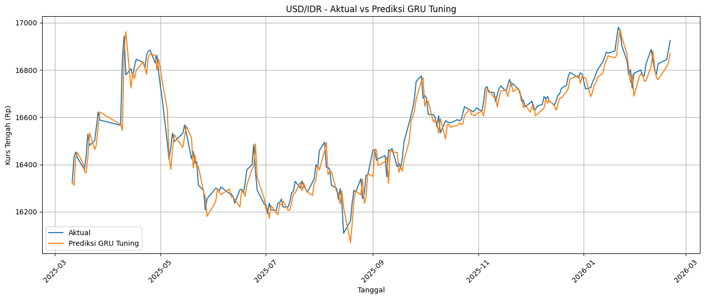
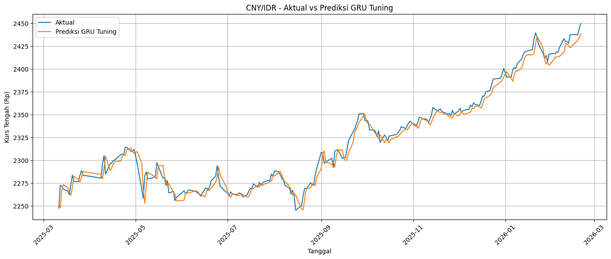
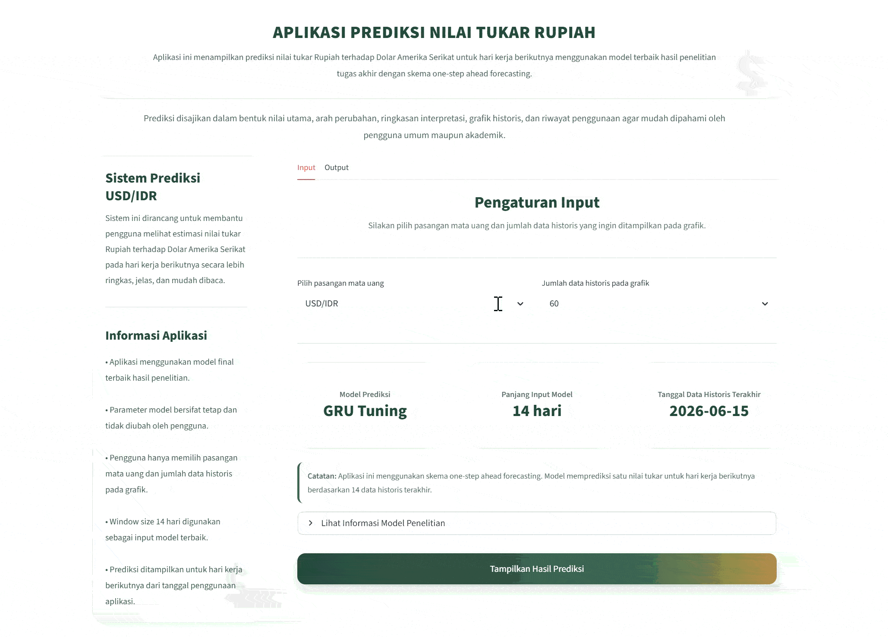

# IDR Exchange Rate Forecasting — LSTM vs GRU

[](https://www.python.org/)
[](https://www.tensorflow.org/)
[](https://streamlit.io/)
[](#)

A deep learning time-series forecasting project comparing **Long Short-Term Memory (LSTM)** and **Gated Recurrent Unit (GRU)** models for predicting the Indonesian Rupiah exchange rate against the **US Dollar (USD/IDR)** and **Chinese Yuan (CNY/IDR)**.

## Project Overview

This project was developed as my **undergraduate final project in Data Science**.

The objective was to evaluate whether LSTM or GRU could more accurately forecast the daily IDR exchange rate against two major foreign currencies with different movement characteristics. The study uses official **Bank Indonesia transaction exchange-rate data from 2020 to 2026** and applies a **one-step-ahead forecasting** approach.

Rather than testing a single architecture, the project compares both recurrent neural network methods across three modeling scenarios:

- Baseline model
- Stacked model
- Hyperparameter tuning

This results in **12 model experiments** across two currency pairs, two deep learning architectures, and three modeling scenarios. The best-performing models were then integrated into a **Streamlit web application** for interactive prediction, visualization, and post-deployment evaluation.

## Problem Statement

Exchange-rate movements are dynamic, non-linear, and temporally dependent, making short-term forecasting a challenging time-series problem.

This project addresses two main questions:

1. How do LSTM and GRU compare when forecasting USD/IDR and CNY/IDR under baseline, stacked, and tuned configurations?
2. Can the best-performing model be implemented into a practical web application for one-step-ahead exchange-rate prediction and evaluation against actual Bank Indonesia data?

## Dataset

The dataset was collected from **Bank Indonesia's official exchange-rate data** and contains daily selling and buying rates for:

- USD/IDR
- CNY/IDR

The middle exchange rate was calculated as:

```text
Middle Rate = (Selling Rate + Buying Rate) / 2
```

Each currency dataset contains **1,498 daily observations** from 2020 to 2026.

### Time-Based Data Split

| Split | Observations | Period |
|---|---:|---|
| Training | 1,048 | Jan 2020 – Mar 2024 |
| Validation | 225 | Apr 2024 – Mar 2025 |
| Testing | 225 | Mar 2025 – Feb 2026 |

The split was performed chronologically **without shuffling** to preserve temporal order and prevent future information from leaking into model training.

## Data Preprocessing

The preprocessing pipeline includes:

1. Calculating the middle exchange rate from Bank Indonesia selling and buying rates
2. Sorting observations chronologically
3. Checking missing values and duplicated dates
4. Performing a time-based train-validation-test split
5. Scaling the exchange-rate series using `MinMaxScaler`
6. Fitting the scaler only on the training set to avoid data leakage
7. Transforming the time series into sequential samples using a sliding-window approach

The forecasting task is **univariate**, meaning the models use historical middle exchange rates as the input signal without additional macroeconomic variables.

## Modeling Approach

Two recurrent deep learning architectures were compared:

### Long Short-Term Memory (LSTM)

LSTM uses separate memory-cell and gating mechanisms to retain information across long sequences and address the vanishing-gradient limitation of standard recurrent neural networks.

### Gated Recurrent Unit (GRU)

GRU provides a more compact recurrent architecture using update and reset gates without a separate cell state, reducing architectural complexity while retaining the ability to learn temporal dependencies.

### Modeling Scenarios

| Scenario | Description |
|---|---|
| Baseline | Single recurrent layer with a standard configuration |
| Stacked | Two recurrent layers to increase model depth |
| Hyperparameter Tuning | Experimental search across window size, units, dropout, learning rate, and batch size |

The tuning experiments evaluated combinations of:

- Window size: `14`, `30`, `60`
- Units: `32`, `64`, `128`
- Dropout: `0.0`, `0.1`, `0.2`
- Batch size: `16`, `32`
- Learning rate: `0.001`, `0.0005`

Training used the **Adam optimizer**, **Mean Squared Error (MSE)** loss, and **early stopping**.

## Evaluation Metrics

Model performance was evaluated using:

- **MAE — Mean Absolute Error**
- **RMSE — Root Mean Squared Error**
- **MAPE — Mean Absolute Percentage Error**

Lower values indicate better forecasting performance.

## Best Model Results

Hyperparameter-tuned **GRU** produced the best test-set performance for both currency pairs.

| Currency Pair | Best Model | Window | Units | Dropout | Learning Rate | Batch Size | MAE | RMSE | MAPE |
|---|---|---:|---:|---:|---:|---:|---:|---:|---:|
| **USD/IDR** | **GRU Tuning** | 14 | 128 | 0.0 | 0.001 | 16 | **40.5664** | **53.6434** | **0.2450%** |
| **CNY/IDR** | **GRU Tuning** | 14 | 128 | 0.0 | 0.001 | 16 | **5.8216** | **7.6903** | **0.2506%** |

The results show that GRU achieved the most consistent performance across both exchange-rate series after hyperparameter tuning.

## Prediction Results

### USD/IDR — GRU Tuning

The tuned GRU closely follows the actual USD/IDR movement across most of the testing period, including gradual trend changes and short-term fluctuations.



### CNY/IDR — GRU Tuning

The tuned GRU also tracks the CNY/IDR series closely and maintains the direction of the upward trend toward the end of the testing period.



## Streamlit Application

The best GRU models and their corresponding scalers were saved and integrated into a Streamlit-based application.

The application supports:

- USD/IDR and CNY/IDR currency selection
- One-step-ahead exchange-rate prediction
- Latest historical exchange-rate display
- Predicted value and percentage change
- Direction-of-movement interpretation
- Historical chart and prediction point visualization
- Prediction history
- Business-day-aware forecasting that accounts for weekends, national holidays, and collective leave



### Post-Deployment Evaluation

The deployed system was also evaluated against newly observed Bank Indonesia exchange-rate data.

| Currency Pair | Average Observed Error |
|---|---:|
| USD/IDR | **0.3662%** |
| CNY/IDR | **0.5549%** |

This stage was used to assess how the saved models behaved when applied to observations collected after model development.

## Tech Stack

- Python
- TensorFlow / Keras
- Scikit-learn
- Pandas
- NumPy
- Matplotlib
- Streamlit
- Joblib
- Jupyter Notebook

## Repository Structure

```text
prediksi-nilai-tukar-rupiah-usd-cny/
├── assets/
│   ├── usd_gru_tuning_actual_vs_prediction.png
│   ├── cny_gru_tuning_actual_vs_prediction.png
│   └── streamlit_prediction_preview.png
├── models/
│   ├── usd_gru_tuning.keras
│   └── cny_gru_tuning.keras
├── scalers/
│   ├── usd_scaler.pkl
│   └── cny_scaler.pkl
├── USD.xlsx
├── CNY.xlsx
├── ObsUSD.xlsx
├── ObsCNY.xlsx
├── app.py
├── fixprogram.ipynb
├── requirements.txt
├── runtime.txt
└── README.md
```

## Running the Project Locally

Clone the repository:

```bash
git clone https://github.com/widiearry/prediksi-nilai-tukar-rupiah-usd-cny.git
cd prediksi-nilai-tukar-rupiah-usd-cny
```

Install the required packages:

```bash
pip install -r requirements.txt
```

Run the Streamlit application:

```bash
streamlit run app.py
```

To review the complete modeling workflow, open:

```text
fixprogram.ipynb
```

## Project Scope and Limitations

This project focuses on **short-term univariate forecasting** using historical exchange-rate data. It does not include external macroeconomic variables such as inflation, interest rates, trade balance, or market sentiment.

The application is intended as an academic forecasting prototype and portfolio project rather than a production-grade financial decision system.

## Author

Built by [Ni Putu Widya Antary](https://github.com/widiearry).
